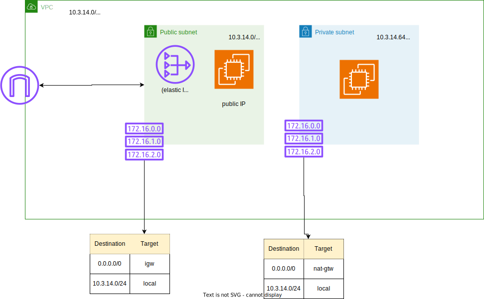

# Diagram


# Steps
* Create VPC
* Create 2 subnets: one public and one private
* Crete Internet Gateway
* Create Route Tables for public and private subnet
* Create Nat Gateway in public subnet with allocation of elastic IP
* Add routes to Routing Tables (public with: destination 0.0.0.0/0 and target igw, private with: destination 0.0.0.0/0 and target nat)
* Create EC2 instance in public subnet with public IP
* Create EC2 insance in private subnet
* Copy ssh keys to your terminal and do

```
ssh -i my_ssh_key.pem ec2-user@ec2_public_ip 
```
and check connction
* Copy ssh key to public EC2 instance from your terminal
```
scp -i my_ssh_key.pem ec2-user@ec2_public_ip:/home/ec2-user/.ssh/
```
* Check connection via ssh to private EC2 from public EC2 instance
```
ssh -i my_ssh_key.pem ec2-user@private_ec2_ip
```
* Check internet connection from private EC2 instance
```
ping google.com
```

* set security rules so as the public instance cannot communicate with internet but private can. User should be able to ssh intopublic instance and into private one from public instance.
